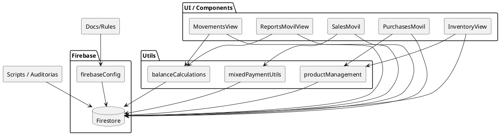
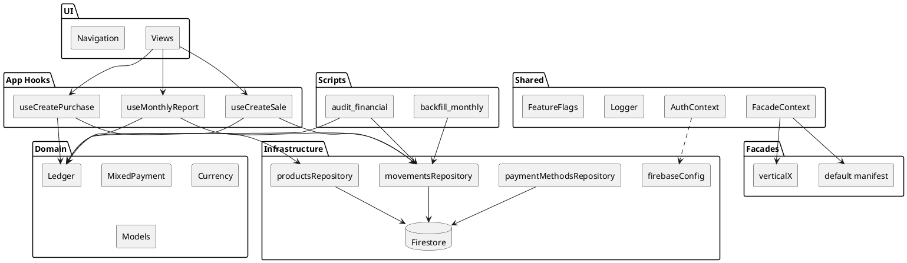

# Arquitectura Actual vs Objetivo

Este documento muestra (a) la arquitectura ACTUAL y (b) la arquitectura OBJETIVO con capas separadas. Incluye diagramas Mermaid y PlantUML para que puedas exportar a imagen (PNG/SVG) con cualquier visor compatible.

---
## 1. Arquitectura Actual (De Facto)

```mermaid
graph TD
  subgraph UI[UI / Components]
    MV[MovementsView]
    RM[ReportsMovilView]
    SM[SalesMovil]
    PM[PurchasesMovil]
    INV[InventoryView]
  end

  subgraph Utils[Utils (mezcla negocio + helpers)]
    BAL[balanceCalculations]
    MIX[mixedPaymentUtils]
    PROD[productManagement]
  end

  subgraph Firebase[Firebase Infra]
    CFG[firebaseConfig]
    FS[(Firestore)]
  end

  Scripts[scripts & auditorias]
  Docs[docs / config / rules]

  MV --> BAL
  RM --> BAL
  SM --> MIX
  PM --> PROD
  INV --> PROD

  MV --> FS
  RM --> FS
  SM --> FS
  PM --> FS
  INV --> FS

  BAL --> FS
  MIX --> FS
  PROD --> FS

  Scripts --> FS
  Docs --> CFG
  CFG --> FS
```

**Características:**
- Componentes UI llaman directamente Firestore.
- Utils contienen mezcla de reglas y acceso datos.
- No hay repos, ni capa de dominio aislada, ni hooks de aplicación.

**Riesgos:** acoplamiento, duplicación lógica, testing difícil, escalado multi-vertical costoso.

---
## 2. Arquitectura Objetivo (Capas)

```mermaid
graph LR
  subgraph UI[UI (Presentación)]
    Views[Views / Components]
    Navigation[Router / Layout]
  end

  subgraph APP[Capa Aplicación (Hooks Casos de Uso)]
    useSale[useCreateSale]
    usePurchase[useCreatePurchase]
    useMonthly[useMonthlyReport]
  end

  subgraph DOMAIN[Dominio Puro]
    Ledger[ledger.js]
    Mixed[mixedPayment]
    Currency[currency]
    Models[(Entities)]
  end

  subgraph INFRA[Infra / Adapters]
    MovRepo[movementsRepository]
    ProdRepo[productsRepository]
    PayRepo[paymentMethodsRepository]
    FirebaseCfg[firebaseConfig]
    Firestore[(Firestore)]
  end

  subgraph SHARED[Shared / Cross]
    AuthCtx[AuthContext]
    FacadeCtx[Facade Context]
    Logger[Logger]
    FeatureFlags[Feature Flags]
  end

  subgraph FACADES[Facades]
    default[default manifest]
    verticalX[otra vertical]
  end

  subgraph SCRIPTS[Scripts / Auditoría]
    Audit[audit_financial]
    Backfill[backfill_monthly]
  end

  UI --> APP
  APP --> DOMAIN
  APP --> INFRA
  APP --> SHARED
  UI --> SHARED
  FACADES --> SHARED
  INFRA --> Firestore
  DOMAIN -->|no depende| X[ ]
  SCRIPTS --> DOMAIN
  SCRIPTS --> INFRA
```

**Principios:**
- UI no conoce Firestore directo.
- Dominio no importa React ni Firebase.
- Infra implementa repos; APP orquesta.
- Facades inyectan terminología, branding y overrides.

---
## 3. PlantUML (Actual)

Guarda este texto como `arquitectura_actual.puml` y genera PNG: `plantuml arquitectura_actual.puml`.



---
## 4. PlantUML (Objetivo)


---
## 5. Uso rápido
- Ver Mermaid: abrir este archivo en un visor compatible (GitHub / VSCode Markdown Preview Mermaid).
- Export PNG/SVG PlantUML: usar plugin VSCode PlantUML o comando CLI.
- Para compartir sólo el gráfico actual: recortar sección correspondiente.

## 6. Próximos pasos
- Crear `CAPAS.md` (objetivo) usando sección 2 + PlantUML objetivo.
- Iniciar extracción ledger (Sprint 1).

---
© Arquitectura base – generado automáticamente.
