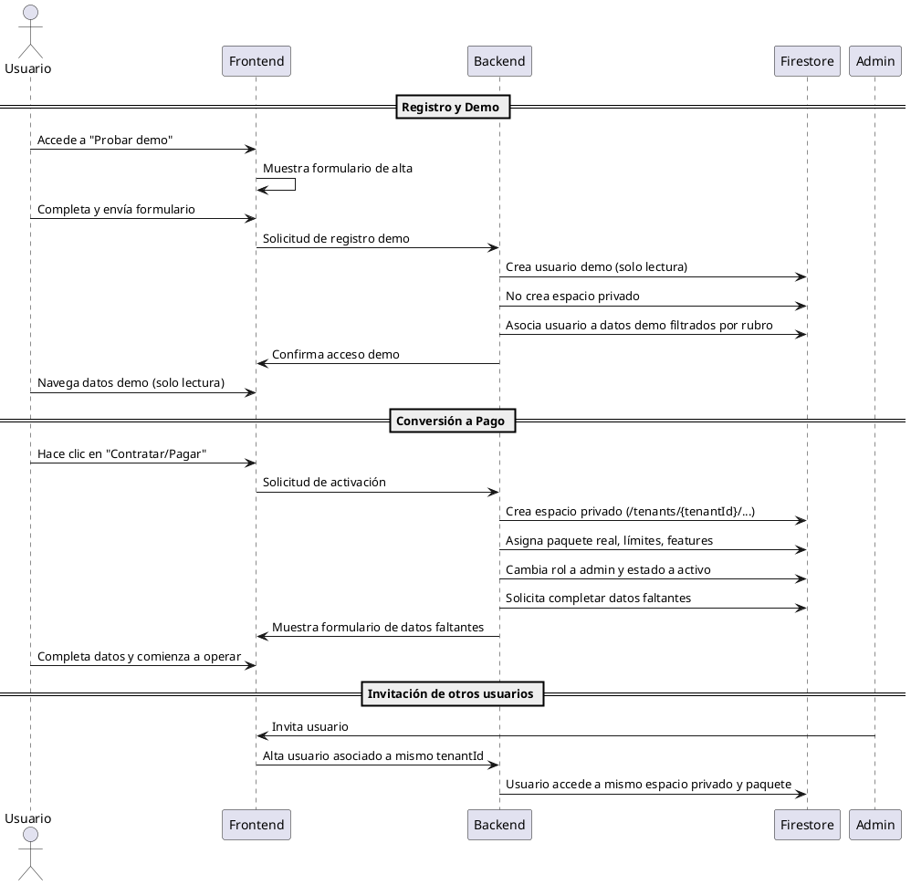
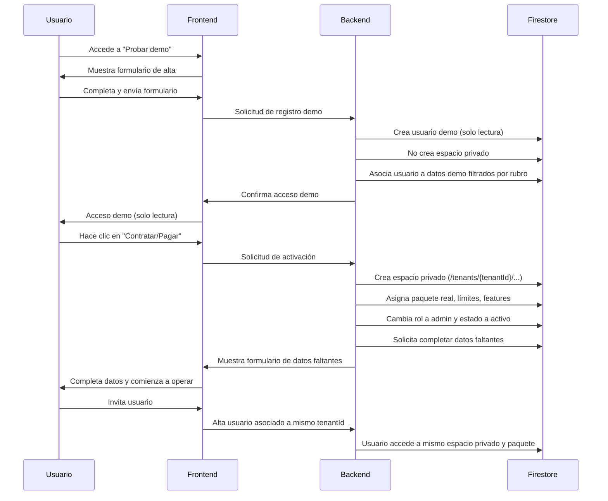

# Flujo de Registro, Demo y Conversión a Pago (Multi-tenant)

## 1. Registro y Acceso a la Demo
- El usuario accede a “Probar demo” en la web.
- Se lo redirige al formulario de alta, donde ingresa datos mínimos (email, rubro, etc.).
- Al registrarse:
  - Se crea un usuario demo con permisos de solo lectura.
  - No se crea un espacio privado, ni se guardan datos propios.
  - El usuario accede a una base de datos compartida, con datos de prueba filtrados por rubro.
  - No puede modificar ni agregar datos.

## 2. Uso de la Demo
- El usuario explora la app con datos de prueba, limitados por rubro.
- No puede escribir ni guardar información real.
- No se almacena ningún dato personal ni de negocio propio.

## 3. Conversión a Usuario Pago (Admin)
- El usuario decide contratar el servicio (pagar).
- Al pagar:
  - Se crea un espacio privado para el usuario (colecciones bajo `/tenants/{tenantId}/...`).
  - Se le solicita completar los datos faltantes (empresa, contacto, etc.) en un formulario inicial.
  - Se le asigna un paquete real (por ejemplo, `basic`, `pro`), con sus límites y features.
  - El usuario pasa a tener permisos de admin y puede operar normalmente.
  - Su base de datos privada comienza vacía, lista para cargar datos reales.
  - No se migran datos de la demo, ya que eran solo de prueba y de solo lectura.

## 4. Manejo de Usuarios y Tenants
- Si el admin invita a más usuarios, todos comparten el mismo espacio privado y paquete.
- Cada tenant (empresa) tiene su propio paquete, límites y datos aislados.

## 5. Ventajas del Modelo
- Simplicidad: no hay migración de datos de demo a real.
- Seguridad: los datos de prueba nunca se mezclan con datos reales.
- Experiencia clara: el usuario entiende que la demo es solo para explorar y que su espacio real será limpio y privado.
- Escalabilidad: cada tenant es independiente y puede crecer según su paquete.

## Criterio de Alta en Colección `users`

- El alta de un usuario en la colección `users` debe realizarse únicamente después de validar el pre-registro en `users_by_email`.
- El identificador (ID) del documento en la colección `users` debe ser siempre el email del usuario (en minúsculas), no un UID ni un ID autogenerado.
- El flujo correcto es:
  1. Validar existencia y estado en `users_by_email`.
  2. Si es válido, crear el documento en `users` usando el email como ID.
  3. El documento debe contener los datos del usuario y reflejar el estado correspondiente.
- Este criterio debe respetarse en todos los puntos de alta, edición y eliminación de usuarios.

> Ejemplo en Firestore:
>
> - Colección: `users`
> - Documento: `usuario@email.com`
> - Datos: `{ nombre, apellido, ... }`

---

## Diagrama de Secuencia (PlantUML)

---

## Diagrama de Secuencia (Mermaid)

---

Este documento resume el flujo y la lógica multi-tenant para registro, demo y conversión a pago en el sistema Mundo Floral.
